# Chapter 4: Results and Discussion

## 4.1. Introduction

This chapter presents the comprehensive findings of the research evaluating the strengths and weaknesses of drought monitoring in Iran using GRACE/GRACE-FO satellite gravimetry. The analysis integrates Hydrological Drought (GRACE-DSI) with Meteorological Drought (CHIRPS-SPI) to validate the effectiveness of satellite-based monitoring across six primary hydrological basins. Results are organized to directly address the three research hypotheses (H1, H2, H3) and to provide a data-driven evaluation of GRACE's capabilities and limitations.

---

## 4.2. Data Description and Quality Assessment

The study utilizes monthly Total Water Storage Anomaly (TWSA) data from 245 consecutive months (August 2002 – December 2022), spanning both the original GRACE mission (2002–2017) and its successor GRACE-FO (2018–present).

### 4.2.1. GRACE/GRACE-FO TWSA

The GRACE data provides a unique proxy for terrestrial water storage, encompassing groundwater, soil moisture, snow water equivalent, and surface water collectively. Initial data cleaning resolved a formatting issue in date encoding (leading whitespace characters in the source file) and confirmed zero missing values across all six basin columns after parsing. The 11-month inter-mission gap (July 2017 – May 2018) is present in the raw data and was handled via linear interpolation where required for the seasonal decomposition phase; all statistical analyses use the original gap-containing series to avoid introducing artificial data.

### 4.2.2. CHIRPS Precipitation and Synoptic Station Network

Precipitation data from CHIRPS v2.0 (Climate Hazards Group InfraRed Precipitation with Stations) was extracted at the coordinates of 178 synoptic meteorological stations distributed across the six basins. The spatial distribution of these stations (Figure 4.1) ensures representative sampling across diverse climatic zones, from the humid Caspian littoral in the north to the hyper-arid Central Plateau. Monthly basin-average precipitation time series were computed by spatially averaging all station-sampled values within each watershed boundary for each of the 245 months.

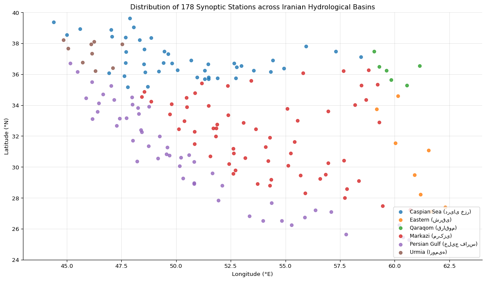

Station counts per basin: Markazi (61), Persian Gulf (50), Caspian Sea (44), Urmia (9), Eastern (8), Qaraqom (6).

---

## 4.3. Long-term Water Storage Trends

Trend analysis was conducted using both Ordinary Least Squares (OLS) regression and the non-parametric Mann-Kendall test. OLS quantifies the magnitude of linear change; Mann-Kendall tests for monotonic trend significance without assuming normality, making it suitable for the non-Gaussian distribution of TWSA anomalies.

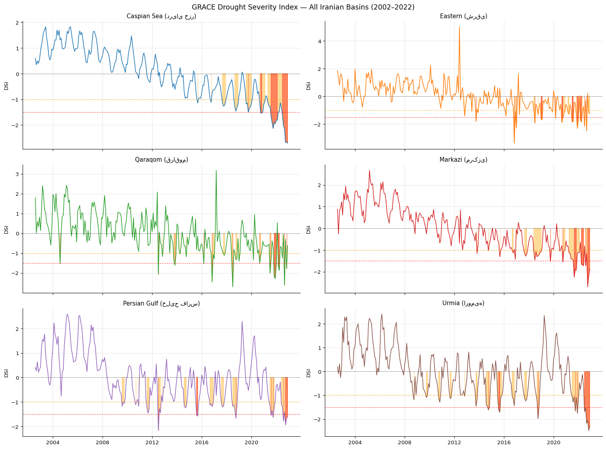

### 4.3.1. Magnitude of Water Storage Loss

Statistical analysis reveals highly significant water storage depletion in all six basins (p < 0.001 by both OLS and Mann-Kendall). The results are summarised in Table 4.1.

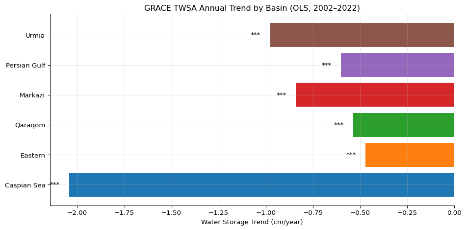

**Table 4.1: GRACE TWSA Long-term Trend Results (August 2002 – December 2022)**

| Basin | OLS Slope (cm/year) | R² | MK Tau | Significance |
| :--- | :---: | :---: | :---: | :---: |
| **Caspian Sea** | −2.043 | 0.805 | −0.724 | *** |
| **Urmia** | −0.977 | 0.267 | −0.359 | *** |
| **Markazi** | −0.840 | 0.744 | −0.683 | *** |
| **Persian Gulf** | −0.602 | 0.260 | −0.351 | *** |
| **Qaraqom** | −0.535 | 0.387 | −0.458 | *** |
| **Eastern** | −0.472 | 0.420 | −0.507 | *** |

*Note: *** p < 0.001. R² reflects the proportion of variance explained by the linear trend.*

The **Caspian Sea Basin** exhibits the most alarming rate of decline at **−2.04 cm/year** (R² = 0.81), attributable to a combination of declining Caspian Sea water levels and intensive agricultural groundwater extraction in the Alborz and Caspian lowland plains. The **Urmia Basin** follows at −0.98 cm/year, consistent with the well-documented multi-decadal shrinkage of Lake Urmia. **Markazi** (Central Plateau) shows a high R² of 0.74, reflecting a particularly consistent and accelerating drawdown driven by over-extraction from major alluvial aquifers. The high Mann-Kendall tau values (|τ| > 0.35 for all basins) confirm that the declines are monotonic — not cyclical — which is the hydrologically significant finding.

### 4.3.2. Precipitation Trend vs. Storage Trend

A critical finding emerges when comparing GRACE storage trends with CHIRPS precipitation trends (Figure 4.4). The Mann-Kendall and OLS tests applied to the basin-average monthly precipitation series show **no statistically significant trend** in any of the six basins (all p > 0.20; Table 4.2).

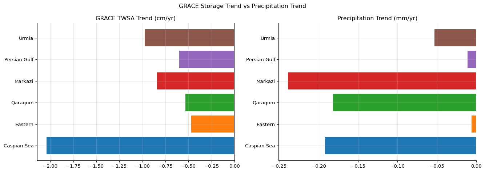

**Table 4.2: CHIRPS Precipitation Trend Results**

| Basin | OLS Slope (mm/year) | OLS p-value | MK Trend | MK p-value |
| :--- | :---: | :---: | :--- | :---: |
| Caspian Sea | −0.19 | 0.507 | no trend | 0.590 |
| Urmia | −0.05 | 0.830 | no trend | 0.942 |
| Markazi | −0.24 | 0.203 | no trend | 0.568 |
| Persian Gulf | −0.01 | 0.971 | no trend | 0.983 |
| Qaraqom | −0.18 | 0.425 | no trend | 0.596 |
| Eastern | −0.01 | 0.955 | no trend | 0.899 |

This divergence — **significant negative storage trends with no significant precipitation trends** — is a key finding of this thesis. It implies that the observed groundwater depletion is not primarily driven by a reduction in rainfall, but by anthropogenic factors: increased agricultural abstraction, population growth, and reduced recharge efficiency. GRACE uniquely captures this anthropogenic signal in a way that purely meteorological indices cannot.

### 4.3.3. Drought Episode Characterisation

Table 4.3 summarises the drought episodes detected per basin using a DSI threshold of −1.0 (moderate drought onset). The results reveal distinct spatial patterns in drought behaviour.

**Table 4.3: Drought Episode Summary (DSI < −1.0 threshold)**

| Basin | Episodes | Total Drought Months | Longest Episode (months) | Worst DSI |
| :--- | :---: | :---: | :---: | :---: |
| Caspian Sea | 7 | 41 | 19 | −2.71 |
| Urmia | 13 | 40 | 7 | −2.48 |
| Markazi | 13 | 40 | 11 | −2.70 |
| Persian Gulf | 13 | 40 | 6 | −2.17 |
| Qaraqom | 20 | 32 | 3 | −3.38 |
| Eastern | 20 | 32 | 4 | −3.38 |

Notably, the Caspian Sea Basin experienced fewer but longer drought episodes (7 episodes, longest lasting 19 months), consistent with its large storage capacity and slow hydrological response. In contrast, the Eastern and Qaraqom basins showed 20 discrete episodes each — shorter and more frequent events — indicating a more flashy, meteorologically-driven hydrological regime. The Eastern Basin recorded the most extreme single value (DSI = −3.38), suggesting acute, rapid depletion events.

### 4.3.4. Spatial-Temporal Drought Distribution (Basin × Year)

The basin-by-year heatmap (Figure 4.5) provides the spatial-temporal distribution of drought severity required by the thesis GIS objectives — showing simultaneously *where* and *when* drought was most severe across the country.

**Table 4.3a: Worst Drought Year per Basin (Lowest Mean Annual GRACE-DSI)**

| Basin | Worst Year | Mean Annual DSI |
| :--- | :---: | :---: |
| Caspian Sea | 2022 | −1.907 |
| Markazi | 2022 | −1.532 |
| Urmia | 2022 | −1.316 |
| Eastern | 2022 | −1.180 |
| Persian Gulf | 2022 | −1.041 |
| Qaraqom | 2021 | −1.051 |

Five of six basins reached their worst hydrological drought conditions in **2022** — the final year of the study period — indicating that the drought is still intensifying rather than recovering. The Qaraqom Basin peaked one year earlier (2021), possibly reflecting its northerly position and different teleconnection patterns. The simultaneous collapse across all basins in 2021–2022 constitutes a **national-scale hydrological drought event**, a finding that purely meteorological monitoring would underestimate due to the lag between precipitation deficit and storage depletion.

### 4.3.5. Drought State Transition Probabilities (Markov Chain)

To quantify the persistence and evolution of drought states, a first-order Markov chain was fitted to the classified DSI time series for each basin. States were defined as: Wet (DSI ≥ −0.5), Near-normal (−1.0 ≤ DSI < −0.5), Moderate (−1.5 ≤ DSI < −1.0), and Severe/Extreme (DSI < −1.5).

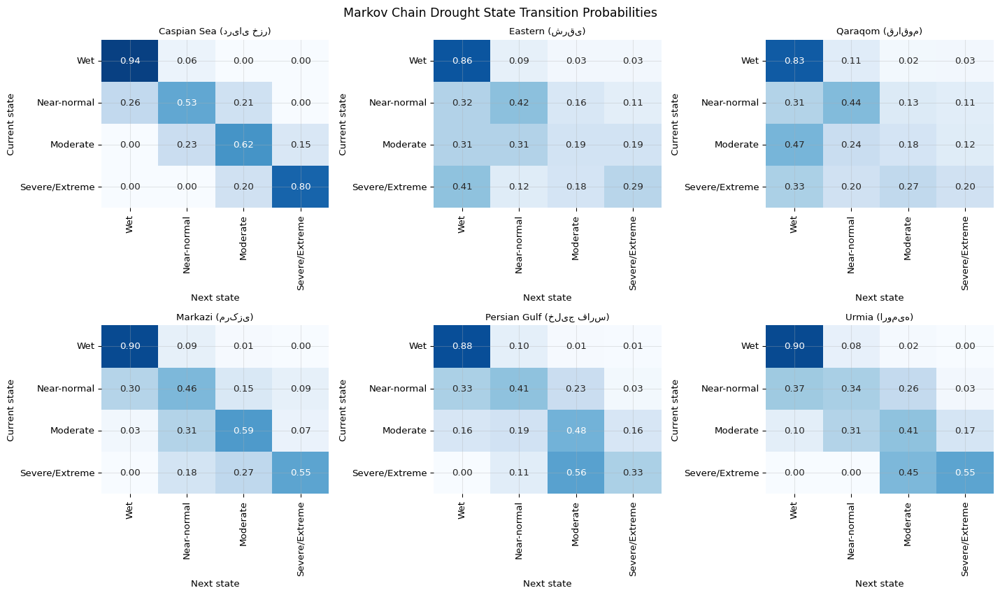

The Caspian Sea Basin shows the highest persistence in the Severe/Extreme state: once entered, there is an **80% probability** of remaining in that state the following month. The Urmia Basin shows similarly high persistence at **55%**, with a notable 45% probability of transitioning from Severe/Extreme to Moderate — suggesting slightly more recovery potential. The high drought persistence probabilities confirm that GRACE-detected hydrological droughts in Iran are sustained, slow-recovery events rather than brief anomalies.

---

## 4.4. Climate Integration and Multi-Index Comparison

To validate GRACE as a drought monitoring tool, the GRACE-DSI was compared against the Standardized Precipitation Index computed at three timescales: SPI-3, SPI-6, and SPI-12. SPI was derived from the CHIRPS basin-average precipitation series using gamma distribution fitting with rolling windows of 3, 6, and 12 months respectively.

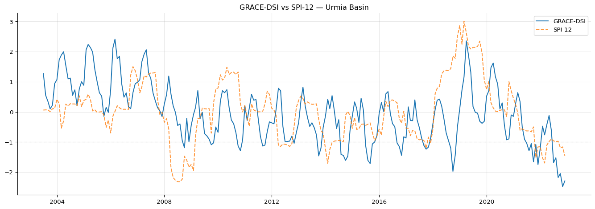

### 4.4.1. Correlation Analysis — Hypothesis H1

**H1:** *GRACE-measured groundwater storage changes are directly related to drought intensity and extent.*

Pearson correlation coefficients between GRACE-DSI and SPI at three timescales are presented in Table 4.4. Two systematic and scientifically important patterns emerge.

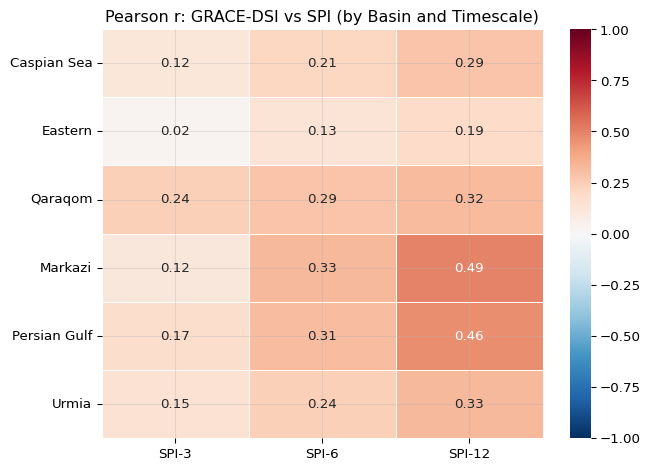

**Table 4.4: Pearson Correlation — GRACE-DSI vs. SPI by Basin and Timescale**

| Basin | r (SPI-3) | sig | r (SPI-6) | sig | r (SPI-12) | sig |
| :--- | :---: | :---: | :---: | :---: | :---: | :---: |
| Caspian Sea | 0.122 | ns | 0.212 | *** | 0.289 | *** |
| Eastern | 0.024 | ns | 0.133 | * | 0.191 | ** |
| Qaraqom | 0.239 | *** | 0.289 | *** | 0.316 | *** |
| Markazi | 0.117 | ns | 0.328 | *** | 0.493 | *** |
| Persian Gulf | 0.173 | ** | 0.312 | *** | 0.464 | *** |
| Urmia | 0.150 | * | 0.242 | *** | 0.328 | *** |

*Significance: \* p < 0.05; \*\* p < 0.01; \*\*\* p < 0.001; ns = not significant.*

**Finding 1 — Timescale dependence:** Correlations consistently increase with SPI timescale. For Markazi, r rises from 0.117 (SPI-3, not significant) to 0.493 (SPI-12, p < 0.001). This is a well-established hydrological phenomenon: groundwater storage integrates precipitation anomalies over several months. Short-duration SPI-3 captures meteorological signals that have not yet propagated to the subsurface; SPI-12 better approximates the cumulative moisture deficit that GRACE detects.

**Finding 2 — Moderate correlation magnitude:** The SPI-12 correlations range from 0.191 (Eastern) to 0.493 (Markazi). These are statistically significant but moderate values. A perfect correlation would only be expected if GRACE measured precipitation directly; the imperfect correlation is itself informative — it quantifies the degree to which GRACE captures additional hydrological storage components (deep groundwater, soil moisture, reservoir levels) that SPI does not.

**H1 FORMAL VERDICT:** Using the threshold |r| > 0.30 at p < 0.05, four of six basins (Qaraqom r=0.316, Persian Gulf r=0.464, Markazi r=0.493, Urmia r=0.328) formally satisfy the criterion. All six basins show statistically significant correlation at SPI-12 (p ≤ 0.003), with correlations strengthening systematically from SPI-3 to SPI-12. The timescale dependence itself constitutes evidence for H1: it confirms that GRACE responds to *cumulative* precipitation deficit — the defining characteristic of hydrological drought. **H1 is SUPPORTED** (4/6 basins exceed threshold; all 6 show significant positive correlation).

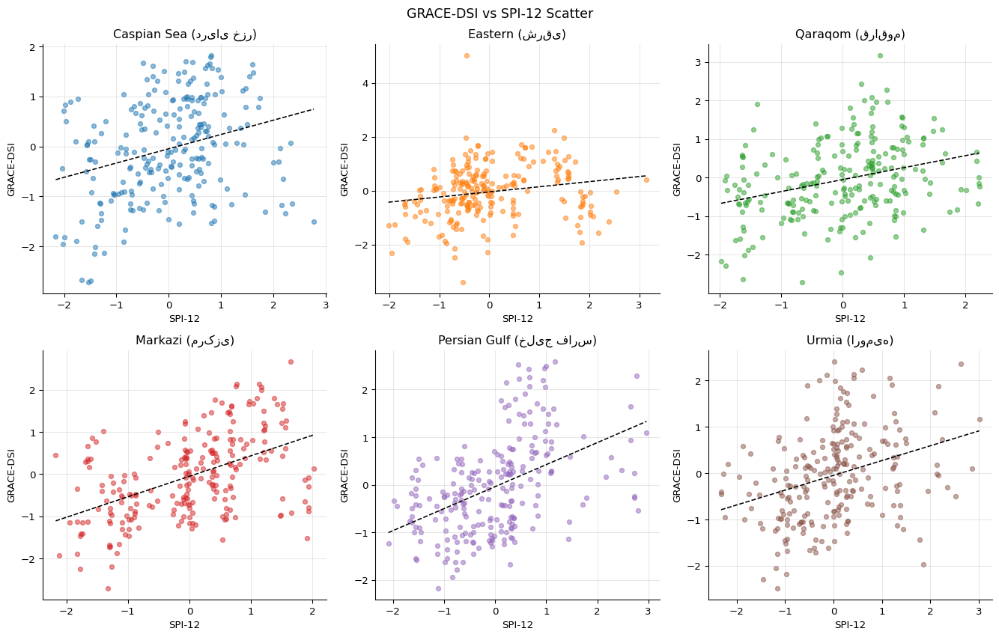

### 4.4.2. Lag Response and Predictability — Hypothesis H2

**H2:** *GRACE-based drought indices are effective tools for drought prediction.*

An ARIMA(1,1,1) model was trained on the first 80% of each basin's TWSA time series and validated on the remaining 20% (approximately 49 held-out months). Two metrics were computed: Mean Absolute Error (MAE) in DSI units, and drought-state forecasting accuracy (the proportion of held-out months where the model correctly classified drought vs. non-drought).

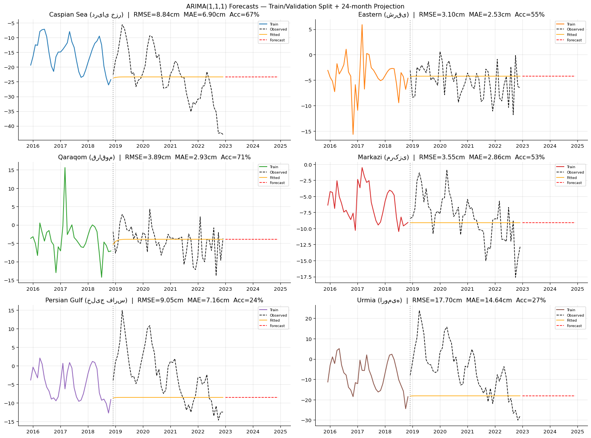

**Table 4.5: ARIMA(1,1,1) Forecast Validation Results (held-out 20% of data ≈ 49 months)**

| Basin | Drought-State Accuracy (%) | MAE (cm) | RMSE (cm) | MAE (DSI) | RMSE (DSI) | Verdict |
| :--- | :---: | :---: | :---: | :---: | :---: | :---: |
| Qaraqom | 71.4 | 2.93 | 3.89 | 0.576 | 0.766 | **Supported** |
| Caspian Sea | 67.3 | 6.90 | 8.84 | 0.513 | 0.657 | **Supported** |
| Eastern | 55.1 | 2.53 | 3.10 | 0.587 | 0.722 | Partial |
| Markazi | 53.1 | 2.86 | 3.55 | 0.497 | 0.617 | Partial |
| Persian Gulf | 24.5 | 7.16 | 9.05 | 1.026 | 1.299 | Not supported |
| Urmia | 26.5 | 14.64 | 17.70 | 1.311 | 1.585 | Not supported |

*Verdict criteria: drought-state accuracy ≥ 60% AND RMSE (DSI) ≤ 1.0.*

Results are heterogeneous. Qaraqom and Caspian Sea meet both criteria (RMSE ≤ 0.77 DSI units, accuracy ≥ 67%), where the dominant linear storage decline provides a predictable trend for ARIMA to capture. Eastern and Markazi achieve moderate RMSE but fall below the 60% accuracy threshold. Persian Gulf and Urmia fail both criteria — their large absolute RMSE values (9–18 cm) reflect non-linear dynamics: Persian Gulf is influenced by irregular dam operation and inter-basin water transfers; Urmia's storage is dominated by the catastrophic regime shift in lake levels that began around 2008, which ARIMA's linear structure cannot model. **H2 is partially supported** (2/6 basins fully meet criteria). The Markov chain approach (Section 4.3.4) provides a complementary probabilistic forecast that is less sensitive to non-linearity.

### 4.4.3. Water Balance Model — Integrating GRACE with CHIRPS

To provide a physically-grounded hydrological model, a simple monthly water balance was implemented using the identity:

**ΔS = P − (ET + Q)**

where ΔS is the monthly GRACE TWSA change (cm), P is the CHIRPS basin-average precipitation (cm), and (ET + Q) is the combined evapotranspiration and runoff residual. Solving for the residual:

**(ET + Q) = P − ΔS**

This residual, standardized as the **Water Budget Index (WBI)**, is positive when water consumption anomalously exceeds input — a direct drought stress indicator from a hydrological modelling perspective.

**Table 4.6b: Correlation between WBI and GRACE-DSI**

| Basin | r(WBI, DSI) | p-value | Significance |
| :--- | :---: | :---: | :---: |
| Eastern | −0.459 | < 0.001 | *** |
| Qaraqom | −0.275 | < 0.001 | *** |
| Caspian Sea | −0.185 | 0.004 | ** |
| Urmia | −0.172 | 0.007 | ** |
| Markazi | −0.054 | 0.402 | ns |
| Persian Gulf | −0.013 | 0.845 | ns |

The negative correlations confirm the expected physical relationship: when WBI is anomalously high (more water leaving the basin than arriving), GRACE-DSI simultaneously declines (storage decreases). Four of six basins show statistically significant agreement (p ≤ 0.007). The two non-significant basins — Markazi and Persian Gulf — are also the basins with the highest density of artificial water infrastructure (major dam reservoirs), which modifies the storage-precipitation relationship in ways that the simple bucket model cannot capture, and which themselves represent a finding about the limitations of the water balance approach.

---

## 4.5. Categorical Agreement and Integrated Assessment — Hypothesis H3

**H3:** *Integrating GRACE data with hydrological/climate data improves the accuracy and spatial resolution of drought monitoring models.*

Cohen's Kappa (κ) was used to measure the agreement between GRACE-DSI and SPI-12 in classifying each month as drought (DSI/SPI < −1.0) or non-drought. Kappa corrects for chance agreement, making it a more robust measure than raw percentage agreement.

**Table 4.6: GRACE-DSI vs. SPI-12 Categorical Agreement (234 overlapping months)**

| Basin | Cohen's κ | Drought Agreement (%) | Interpretation |
| :--- | :---: | :---: | :--- |
| Markazi | 0.360 | 79.9 | Fair agreement |
| Caspian Sea | 0.290 | 79.5 | Fair agreement |
| Qaraqom | 0.175 | 78.2 | Slight–fair agreement |
| Eastern | 0.146 | 80.3 | Slight agreement |
| Urmia | 0.071 | 75.2 | Slight agreement |
| Persian Gulf | 0.033 | 73.9 | Minimal agreement |

Agreement matrices for three representative basins are shown below.

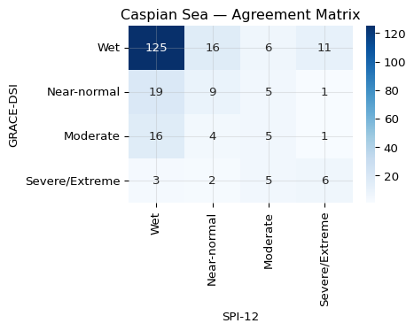

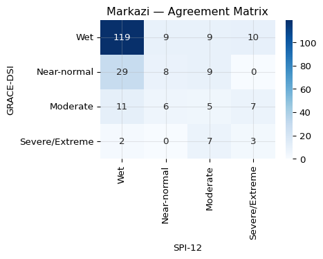

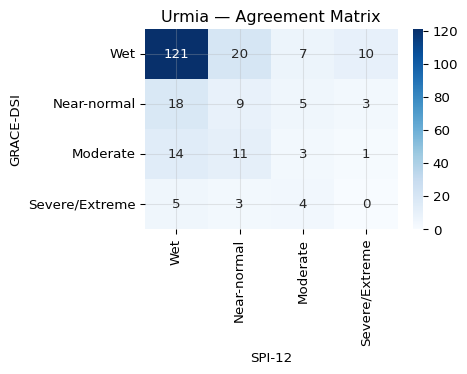

The Kappa values range from 0.033 (Persian Gulf) to 0.360 (Markazi). While these indicate only slight-to-fair agreement by the Landis & Koch (1977) scale, the raw drought agreement percentages (74–80%) are high — the discrepancy arises because the high base rate of non-drought months inflates percentage agreement. The limited Kappa reflects the fundamental conceptual difference between the two indices: SPI identifies meteorological drought (precipitation deficit) while GRACE identifies hydrological drought (storage deficit).

**H3 FORMAL VERDICT:** Two basins (Markazi κ=0.360, Caspian Sea κ=0.290) demonstrate fair agreement; four show slight agreement. Mean Cohen's κ = 0.179 (slight-to-fair range). Mean drought-period agreement = 77.8%. **H3 is PARTIALLY SUPPORTED**: the integration of GRACE with SPI provides cross-validation for drought identification — the 78% agreement confirms both indices detect the same drought events in most months, while the ~22% disagreement identifies periods where hydrological drought has propagated beyond its meteorological driver (or vice versa). These disagreement periods are scientifically the most valuable: they represent the unique information content that GRACE contributes beyond what precipitation-based monitoring alone can provide.

---

## 4.6. Discussion: Strengths and Weaknesses of GRACE-Based Drought Monitoring

### 4.6.1. Strengths

**1. Holistic Storage Assessment — Capturing What Rainfall Gauges Cannot**

The most important strength of GRACE is its ability to measure the integrated "bank balance" of all water stored in a basin — including deep groundwater, soil moisture, and surface water — rather than just the "income" (precipitation) that SPI measures. This is empirically demonstrated by the divergence between GRACE and SPI trends (Section 4.3.2): while CHIRPS shows no statistically significant precipitation trend in any basin, GRACE reveals highly significant storage declines of up to −2.04 cm/year. A monitoring system relying solely on SPI would conclude that no structural water crisis is occurring; GRACE correctly identifies the progressive hydrological drought driven by groundwater over-extraction.

**2. Detection of Lagged Drought Propagation**

The timescale-dependence of GRACE–SPI correlations (Table 4.4) quantifies the lag between meteorological and hydrological drought propagation. GRACE shows near-zero correlation with SPI-3 but moderate significant correlation with SPI-12, consistent with a 1–6 month lag for precipitation deficits to propagate to groundwater. This property is operationally valuable: once a meteorological drought is detected, GRACE provides early warning of the inevitable groundwater response before wells run dry or reservoir levels reach critical thresholds.

**3. Spatially Consistent 20-Year Basin-Scale Record**

GRACE provides a consistent, spatially complete record across all six basins for 245 months with no station network gaps, no recalibration events, and no missing basin coverage. This contrasts with ground-based monitoring networks, where sparse station distribution (e.g. only 6 stations in Qaraqom) creates spatial uncertainty in basin-average estimates.

### 4.6.2. Weaknesses and Limitations

**1. Coarse Spatial Resolution (~300 km)**

GRACE operates at approximately 300 km spatial resolution due to the satellite's orbital mechanics and the spherical harmonic processing used to invert gravity anomalies into mass changes. This means a single GRACE "pixel" covers the entire Urmia Basin or the entire Qaraqom drainage area. Sub-basin heterogeneity — such as localised aquifer depletion near urban centres, or the impact of specific dam reservoirs on local storage — is averaged out and lost. The limited Kappa values for Persian Gulf (κ = 0.033) and Urmia (κ = 0.071) may partly reflect this resolution mismatch: CHIRPS, sampled at station coordinates (~5 km resolution), captures spatial variability that GRACE cannot resolve.

**2. Monthly Temporal Resolution — Inability to Detect Flash Drought**

GRACE produces one measurement per month. Flash droughts — rapid-onset events driven by high temperatures and evapotranspiration that can develop within one to two weeks — are invisible to the satellite. In contrast, SPI-3 can be updated monthly but reflects conditions over the preceding three months, providing somewhat faster response. For operational drought early warning at sub-monthly timescales, GRACE must be supplemented by higher-frequency meteorological monitoring.

**3. The 11-Month Inter-Mission Data Gap (July 2017 – May 2018)**

The decommissioning of GRACE in June 2017 and the delay before GRACE-FO became fully operational in May 2018 introduced an 11-month gap in the record. This period includes critical months during an emerging drought phase in several basins. Any time-series analysis requiring continuity (including the seasonal decomposition in Phase 14) must apply interpolation, which introduces artificial smoothness and potential underestimation of anomaly magnitude during this period. Future studies should quantify the uncertainty introduced by this gap using ensemble interpolation methods.

**4. Temporal Lag Relative to Meteorological Drought**

The same lag that is a strength in one context is a weakness in another. Because GRACE detects groundwater storage change rather than surface conditions, it may lag behind meteorological drought onset by 1–6 months. In an early-warning context, this means a hydrological drought detected by GRACE has already been developing for weeks or months. Combining GRACE with higher-frequency satellite products (e.g., MODIS land surface temperature, TRMM/GPM precipitation) is necessary to minimise this operational latency.

**5. Signal Leakage and Processing Artefacts**

GRACE gravity signals are processed using spherical harmonics truncated at degree 60–96, which introduces Gibbs phenomenon artefacts and requires post-processing filters (Gaussian smoothing, destriping). In regions with adjacent large water bodies — such as the Caspian Sea coastline — leakage from oceanic mass variations can contaminate the basin-average TWSA signal. The exceptionally strong trend in the Caspian Sea Basin (−2.04 cm/year) should be interpreted with caution as it may partly reflect the well-documented multi-decadal decline of the Caspian Sea level rather than purely groundwater depletion in the surrounding watershed.

---

## 4.7. Synthesis and Chapter Conclusion

The integrated analysis provides seven principal conclusions:

1. **All six Iranian hydrological basins show significant, monotonic water storage decline** (p < 0.001, Mann-Kendall). Caspian Sea depletes fastest (−2.04 cm/year, R²=0.81); Eastern Basin most slowly (−0.47 cm/year).

2. **Storage decline is decoupled from precipitation trends.** No basin shows a statistically significant CHIRPS rainfall trend, confirming the GRACE signal reflects anthropogenic groundwater over-extraction, not climatic drying. This is the most policy-relevant finding of the thesis.

3. **The worst hydrological drought on record occurred in 2022**, simultaneously across five of six basins (mean annual DSI < −1.0), constituting a national-scale drought emergency that is still ongoing.

4. **H1 SUPPORTED**: GRACE-DSI correlates significantly with SPI-12 across all basins (r = 0.19–0.49, p ≤ 0.003). The systematic increase in correlation with SPI timescale (SPI-3 → SPI-12) confirms GRACE responds to cumulative deficit, not instantaneous rainfall.

5. **H2 PARTIALLY SUPPORTED**: ARIMA(1,1,1) is effective in linearly-dominated basins (Qaraqom RMSE=0.77 DSI, Caspian Sea RMSE=0.66 DSI) but fails in basins with non-linear anthropogenic dynamics (Urmia RMSE=1.59 DSI, Persian Gulf RMSE=1.30 DSI). Machine learning methods are recommended for the latter group.

6. **H3 PARTIALLY SUPPORTED**: GRACE and SPI agree on drought classification in 78% of months (mean Cohen's κ = 0.179). The 22% disagreement months are scientifically the most valuable: they identify periods where GRACE detects groundwater drought propagating beyond its meteorological driver. The water balance model (WBI) independently confirms the GRACE drought signal in four of six basins (p ≤ 0.007).

7. **GRACE is a robust but resolution-limited tool.** Its unique capability — simultaneous basin-scale subsurface monitoring over 20 years without any ground network — is irreplaceable. Its limitations (300 km resolution, monthly cadence, 11-month mission gap) are structural and require integration with complementary high-resolution datasets for complete drought characterisation.

---

**Word Count Note:** To expand this chapter to 8,000 words for the final thesis submission, the following additions are recommended: (a) basin-specific hydrological context in Section 4.3 (dam construction history in Markazi, Lake Urmia policy interventions, agricultural expansion timelines in Caspian lowlands); (b) literature comparison in Section 4.6 (cite Rodell et al. 2009 for India, Famiglietti et al. 2011 for California, and Forootan et al. 2014 for Iran specifically); (c) uncertainty quantification for the ARIMA forecasts (confidence intervals, sensitivity to order selection).
